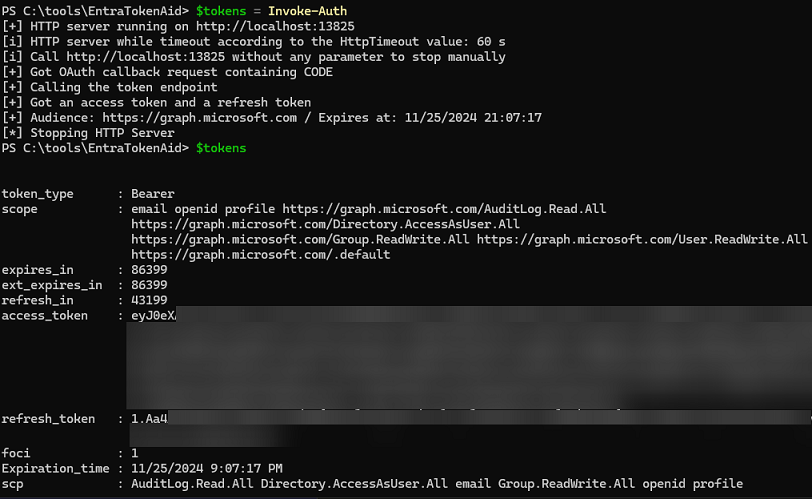
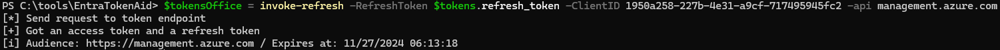
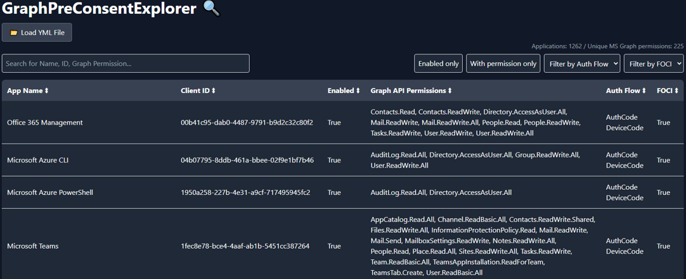
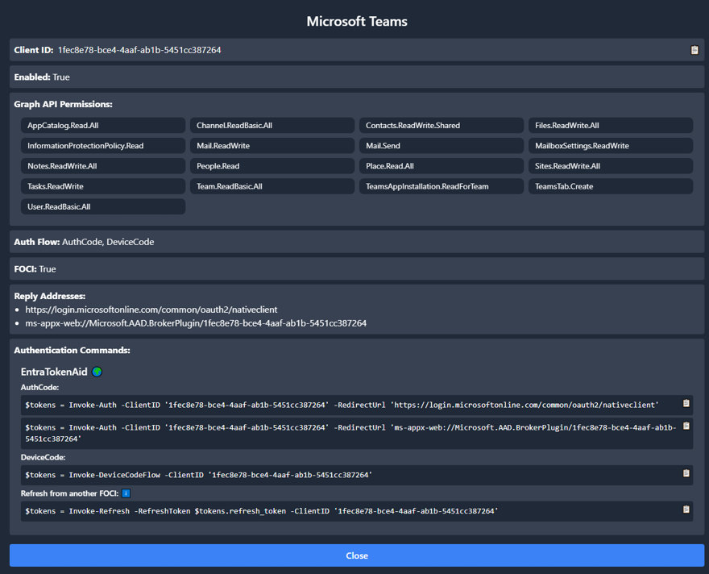

# EntraTokenAid

EntraTokenAid is a PowerShell module to simplify OAuth workflows with Microsoft Entra ID, to get the access and refresh tokens for different APIs using different clients.

Accessing cleartext access and refresh tokens for various MS APIs (e.g., MS Graph) is often a requirement during engagements and research, especially using pre-consented clients (e.g., AzureCLI) to avoid additional consent prompts. Tokens are needed not only for manual enumeration via APIs but also for tools like AzureHound or GraphRunner, which require a valid refresh token. 

With more customers starting to block the Device Code Flow, alternative authentication methods for obtaining cleartext refresh tokens are becoming increasingly important. While using AzureCLI modules is a common solution, its installation may not always be feasible—especially on customer systems. Other alternatives like roadtx require Python, which might not be ideal in customer environments.

This tool bridges this gap with a lightweight, standalone PowerShell solution that works even on customers' Windows systems.

---

## Features

- **No dependencies**: A pure PowerShell single-file module that works on Windows systems (tested in PS 5&7) and partially on Linux.
- **Interactive Authentication**: Supports both OAuth Auth Code Flow and Device Code Flow.
- **Flexible Refresh**: Obtain access tokens for any API and client using refresh tokens.
- **CAE Support**: By default, requests CAE (Continuous Access Evaluation) capable access tokens, valid for 24 hours.
- **JWT Parsing**: Automatically decodes access tokens to display details (e.g., scope, tenant, IP, authentication methods).
- **Avoiding Consent**: By default, the tool uses the Azure CLI client ID, enabling many MS Graph API actions without additional consent due to pre-consented permissions.
- **Parameters**: A wide range of parameters allow you to customize the tool's behavior, such as enabling features like PKCE, CAE, and more, providing greater control during usage.
- **Client Credentials Flow**: Supports app-only authentication via client secret, PFX/P12 certificate, PEM files, Windows certificate store, or a manually provided JWT client assertion.
- **Agent Identity Flows**: Wrapper functions for Microsoft Entra Agent ID OAuth flows: autonomous app, on-behalf-of, and agent user.
- **Automation-Friendly**: Enables automated OAuth Auth Code Flow tests by disabling user selection, with the gathered tokens and claims exported to a CSV file.
- **Experimental: Catching OAuth Codes on any URL**: Utilizes a legacy method to launch and control a browser, allowing automatic retrieval of the authorization code and seamless token exchange (Windows only).
---

## Images
Performing an authentication and showing the gathered tokens and other useful information:



Using the obtained refresh token to get new tokens on another API and using another client (Azure PowerShell):



---
## Installation

1. Clone the repository:
    ```powershell
   git clone https://github.com/zh54321/EntraTokenAid.git
   ```
2. Import the module before usage:
   ```powershell
   Import-Module ./EntraTokenAid/EntraTokenAid.psm1
   ```
---

## Getting Started

The module includes the following commands:

| Command                         | Description                                                    |Default behavior|
|---------------------------------|----------------------------------------------------------------|--------------------------------------------|
| `Invoke-Auth`                   | Perform authentication (auth code flow) and retrieve tokens.   |API: MS Graph / Client: Azure CLI / CAE: Yes|
| `Invoke-DeviceCodeFlow`         | Authenticate via the device code flow.                         |API: MS Graph / Client: Azure CLI|
| `Invoke-ClientCredential`       | Authenticate using the client credential flow.                 |API: MS Graph|
| `Invoke-ROPC`                   | Authenticate using resource owner password credentials (ROPC). |API: MS Graph|
| `Invoke-AgentAutonomousAppFlow` | Agent ID autonomous app flow wrapper.                          |API: MS Graph|
| `Invoke-AgentOnBehalfOfFlow`    | Agent ID on-behalf-of flow wrapper.                            |API: MS Graph|
| `Invoke-AgentUserFlow`          | Agent ID user flow wrapper.                                    |API: MS Graph|
| `Invoke-Refresh`                | Get a new access token using the refresh token.                |API: MS Graph / Client: Azure CLI|
| `Invoke-ParseJwt`               | Decode a JWT and display its body properties.                  |-|
| `Show-EntraTokenAidHelp`        | Show Help.                                                     |-|


### Quick Start

```powershell
# Authenticate with default settings (MS Graph API, Azure CLI client)
$tokens = Invoke-Auth

# Get a token for Azure Resource Manager
$tokens = Invoke-Auth -Api "management.azure.com"

# Get a token with Device Code Flow (MS Graph API, Azure CLI client)
$tokens = Invoke-DeviceCodeFlow

# Refresh the token
$tokens = Invoke-Refresh -RefreshToken $tokens.refresh_token
```
---

## Module Functions

### `Invoke-Auth`

Performs OAuth authentication using the authorization code flow.
By default, tokens from the MS Graph API are requested using Azure CLI as the client.

#### Parameters
All parameters are optional.

| Parameter            | Description                                                                 | Default Value                                     |
|----------------------|-----------------------------------------------------------------------------|---------------------------------------------------|
| **ClientID**         | Specifies the client ID for authentication.                                 | `04b07795-8ddb-461a-bbee-02f9e1bf7b46` (Azure CLI)|
| **Scope**            | Scopes (space separated) to be requested.                                   | `.default offline_access`                         |
| **Api**              | API for which the access token is needed (FQDN or GUID).                    | `graph.microsoft.com`                             |
| **Tenant**           | Specific tenant id.                                                         | `organizations`                                   |
| **Port**             | Local port to listen on for the OAuth callback.                             | `13824`                                           |
| **TokenOut**         | If provided, outputs the raw token to console.                              | `false`                                           |
| **RedirectURL**      | URL for the OAuth redirect.                                                 | `http://localhost:%PORT%`                         |
| **DisableJwtParsing**| Skips the parsing of the JWT.                                               | `false`                                           |
| **DisablePrompt**    | Suppresses interactive user selection. Uses the already logged-in user directly.    | `false`                                           |
| **HttpTimeout**      | Time in seconds the HTTP server waits for the OAuth callback.               | `180`                                              |
| **DisablePKCE**      | Disables the PKCE usage.                                                    | `false`                                           |
| **DisableCAE**       | Disables Continuous Access Evaluation (CAE) support.                        | `false`                                           |
| **ForceMfa**         | Requests an MFA-authenticated context by adding an `amr=mfa` claim.         | `false`                                           |
| **ForceNgcMfa**      | Requests an NGC MFA-authenticated context by adding `amr=ngcmfa,mfa`.       | `false`                                           |
| **Origin**           | Origin Header (required to Auth on a SPA).                                  | `-`                                               |
| **Reporting**        | If provided, enables detailed token logging to csv.                         | `false`                                           |
| **Silent**           | Suppresses status messages written with `Write-Host`.                       | `false`                                           |
| **ManualCode**       | Get auth URL for external login; use final URL with the code to auth        | `false`                                           |
| **SkipGen**          | Skip auth URL generation (use with `-ManualCode`)                           | `false`                                           |
| **LoginHint**        | Pre-fill the username on the login page.                                    | `-`                                               |
| **UserAgent**        | User agent used (token endpoint) (impacts only non-interactive sign-ins)    | `python-requests/2.32.3`                          |  


#### Authentication Examples
Perform authentication and retrieve tokens with default options (MS Graph API / Azure CLI as the client):
```powershell
$Tokens = Invoke-Auth
```
Authenticate on Azure ARM API:
```powershell
$Tokens = Invoke-Auth -API "management.azure.com"
```
Authenticate with a custom client ID and scope:
```powershell
$Tokens = Invoke-Auth -ClientID "your-client-id" -Scope "offline_access Mail.Read"
```
Bypass the Conditional Access Policy which require a compliant device:
```powershell
$Tokens = Invoke-Auth -ClientID '9ba1a5c7-f17a-4de9-a1f1-6178c8d51223' -RedirectUrl 'urn:ietf:wg:oauth:2.0:oob'
```
Get tokens for main.iam.ad.ext.azure.com:
```powershell
$Tokens = Invoke-Auth -Api '74658136-14ec-4630-ad9b-26e160ff0fc6'
```
Request an MFA-authenticated context:
```powershell
$Tokens = Invoke-Auth -ForceMfa
```
Request an NGC MFA-authenticated context:
```powershell
$Tokens = Invoke-Auth -ForceNgcMfa
```
Perform automated testing by disabling user selection (the already logged-in user in the browser will be used), activating reporting, setting the HTTP timeout, and looping through a list of client IDs:
```powershell
# Define the array of GUIDs
$guids = @(
    "1950a258-227b-4e31-a9cf-717495945fc2",
    "7ae974c5-1af7-4923-af3a-fb1fd14dcb7e",
    "5572c4c0-d078-44ce-b81c-6cbf8d3ed39e"
)

# Loop through each GUID in the array
foreach ($guid in $guids) {
    Invoke-Auth -ClientID $guid -DisablePrompt -Reporting -HttpTimeout 5
}
```

#### Usage with 3rd-Party Tooling
Connect to Microsoft Graph API using the official PowerShell modules:
```powershell
$Tokens = Invoke-Auth
Connect-MgGraph -AccessToken ($Tokens.access_token | ConvertTo-SecureString -AsPlainText -Force)
```

Authenticate and use with [AzureHound](https://github.com/BloodHoundAD/AzureHound):
```powershell
$Tokens = Invoke-Auth
.\azurehound.exe --jwt $tokens.access_token --refresh-token $tokens.refresh_token list --tenant $Tokens.tenant -o output-all.json
```

Authenticate and use with [GraphRunner](https://github.com/dafthack/GraphRunner):
```powershell
$tokens = Invoke-Auth
Invoke-GraphRecon -Tokens $tokens -PermissionEnum
```

---

### `Invoke-DeviceCodeFlow`

Authenticate using the device code flow. The browser opens automatically, and the required code is copied to the clipboard.

#### Parameters
All parameters are optional.
| Parameter              | Description                                                                 | Default Value                                     |
|----------------------  |-----------------------------------------------------------------------------|---------------------------------------------------|
| **ClientID**           | Specifies the clientID for authentication.                                  | `04b07795-8ddb-461a-bbee-02f9e1bf7b46` (Azure CLI)|
| **Api**                | API for which the access token is needed (FQDN or GUID).                    | `graph.microsoft.com`                             |
| **Scope**              | Scopes (space separated) to be requested.                                   | `.default offline_access`                         |
| **UserAgent**          | User agent used. | `Mozilla/5.0 (Windows NT 10.0; Win64; x64) AppleWebKit/537.36 (KHTML, like Gecko) Chrome/130.0.0.0 Safari 537`|  
| **Tenant**             | Specific tenant id.                                                         | `organizations`                                   |
| **TokenOut**           | If provided, outputs the raw token to console.                              | `false`                                           |
| **DisableJwtParsing**  | Skips the parsing of the JWT.                                               | `false`                                           |
| **DisableBrowserStart**| Disables the automatic start of the browser.                                | `false`                                           |
| **ForceMfa**           | Requests an MFA-authenticated context by adding an `amr=mfa` claim.         | `false`                                           |
| **ForceNgcMfa**        | Requests an NGC MFA-authenticated context by adding `amr=ngcmfa,mfa`.       | `false`                                           |
| **Reporting**          | If provided, enables detailed token logging to csv.                         | `false`                                           |  
| **Silent**             | Suppresses status messages written with `Write-Host`.                       | `false`                                           |


#### Example

Simple start of the device code flow with default options.
```powershell
Invoke-DeviceCodeFlow
```
Get tokens for the Azure Resource Manager API
```powershell
Invoke-DeviceCodeFlow -API management.azure.com
```
Authenticate using the device code flow, specifying the client ID and API.
```powershell
$Token = Invoke-DeviceCodeFlow -ClientID "your-client-id" -Api "graph.microsoft.com"
```
Request an MFA-authenticated context:
```powershell
Invoke-DeviceCodeFlow -ForceMfa
```
Request an NGC MFA-authenticated context:
```powershell
Invoke-DeviceCodeFlow -ForceNgcMfa
```
Connect to MS Graph API:
```powershell
Connect-MgGraph -AccessToken ($Tokens.access_token | ConvertTo-SecureString -AsPlainText -Force)
```

Authenticate and use with [AzureHound](https://github.com/BloodHoundAD/AzureHound):
```powershell
$Tokens = Invoke-DeviceCodeFlow
.\azurehound.exe --refresh-token $Tokens.refresh_token list --tenant $Tokens.tenant -o output-all.json
```

---

### `Invoke-ClientCredential`

Authenticate using the client credential flow with one of these methods:
- Client secret
- Certificate-based client assertion (certificate file or Windows cert store)
- PEM certificate + key based client assertion
- Manually provided `client_assertion` JWT

#### Common Parameters

| Parameter           | Description                                                  | Default Value         |
|---------------------|--------------------------------------------------------------|-----------------------|
| **ClientId**        | Client ID of the application (MANDATORY).                    | -                     |
| **TenantId**        | Tenant ID (MANDATORY).                                       | -                     |
| **Api**             | API for which the access token is needed (FQDN or GUID).     | `graph.microsoft.com` |
| **Scope**           | Scopes (space-separated) to be requested.                    | `.default`            |
| **UserAgent**       | User agent used in HTTP requests.                            | Chrome 130 UA         |
| **TokenOut**        | If provided, outputs the raw token to console.               | `false`               |
| **DisableJwtParsing** | Skips the parsing of the JWT.                              | `false`               |
| **FmiPath**         | Optional `fmi_path` parameter (autonomous agent scenarios).  | -                     |
| **Reporting**       | If provided, enables detailed token logging to CSV.          | `false`               |
| **Silent**          | Suppresses status messages written with `Write-Host`.        | `false`               |

#### Credential Methods (choose exactly one)

**Client secret**

| Parameter        | Description                                               | Default Value |
|------------------|-----------------------------------------------------------|---------------|
| **ClientSecret** | Client secret of the application (secure prompt if empty). | -             |

**PFX / P12 certificate file**

| Parameter               | Description                              | Default Value |
|-------------------------|------------------------------------------|---------------|
| **CertificatePath**     | Path to a PFX/P12 certificate file.      | -             |
| **CertificatePassword** | Optional password for the PFX file.      | -             |

**PEM certificate + key files** *(requires PowerShell 7+ / .NET 5+)*

| Parameter                  | Description                                    | Default Value |
|----------------------------|------------------------------------------------|---------------|
| **CertificatePemPath**     | Path to PEM certificate file (e.g. `cert.pem`). | -           |
| **PrivateKeyPemPath**      | Path to PEM private key file (e.g. `key.pem`).  | -           |
| **PrivateKeyPemPassword**  | Optional password for an encrypted PEM key.    | -             |

**Windows certificate store**

| Parameter                     | Description                                                        | Default Value  |
|-------------------------------|--------------------------------------------------------------------|----------------|
| **CertificateThumbprint**     | Thumbprint of a certificate in the Windows cert store (MANDATORY). | -              |
| **CertificateStoreLocation**  | Certificate store location.                                        | `CurrentUser`  |
| **CertificateStoreName**      | Certificate store name.                                            | `My`           |

**Manual client assertion**

| Parameter           | Description                           | Default Value |
|---------------------|---------------------------------------|---------------|
| **ClientAssertion** | Manually provided JWT client assertion. | -           |


#### Example

Authenticates with the specified client ID and secret, targeting the default Microsoft Graph API.
```powershell
Invoke-ClientCredential -ClientId "your-client-id" -ClientSecret "your-client-secret" -TenantId "your-tenant-id"
```

Uses a certificate file (PFX/P12):
```powershell
Invoke-ClientCredential -ClientId "your-client-id" -TenantId "your-tenant-id" -CertificatePath "appcert.pfx"
```
```powershell
$pw = ConvertTo-SecureString "ChangeMe!" -AsPlainText -Force
Invoke-ClientCredential -ClientId "your-client-id" -TenantId "your-tenant-id" -CertificatePath "appcert.pfx" -CertificatePassword $pw
```

Uses PEM certificate + key files:
```powershell
Invoke-ClientCredential -ClientId "your-client-id" -TenantId "your-tenant-id" -CertificatePemPath "cert.pem" -PrivateKeyPemPath "key.pem"
```

Quick PowerShell example to generate a self-signed test certificate and export a `PFX` file on Windows:
```powershell
$daysValid = 365
$name = "EntraTokenAid-Test"
$after = (Get-Date).AddDays($daysValid)
$cert = New-SelfSignedCertificate -Subject "CN=$name" -KeyLength 4096 -NotAfter $after -CertStoreLocation "Cert:\CurrentUser\My" -KeyExportPolicy Exportable
Export-Certificate -Cert $cert -FilePath ".\$name.cer"
Export-PfxCertificate -Cert $cert -FilePath ".\$name.pfx" -Password (Read-Host "PFX password" -AsSecureString)
Write-Host "Thumbprint: $($cert.Thumbprint) Valid until: $($cert.NotAfter)"
```
Upload `$name.cer` to the Entra app registration. Then use `$name.pfx` with `-CertificatePath`.

Quick OpenSSL example to generate PEM files:
```powershell
openssl req -x509 -newkey rsa:2048 -keyout key.pem -out cert.pem -days 365 -nodes -subj "/CN=EntraTokenAid-Test"
openssl x509 -outform der -in cert.pem -out cert.cer
```
Upload `cert.cer` to the Entra app registration. Then use `cert.pem` + `key.pem` with `-CertificatePemPath` and `-PrivateKeyPemPath`.

Uses a certificate directly from the Windows certificate store:
```powershell
Invoke-ClientCredential -ClientId "your-client-id" -TenantId "your-tenant-id" -CertificateThumbprint "0123456789ABCDEF0123456789ABCDEF01234567" -CertificateStoreLocation CurrentUser -CertificateStoreName My
```

Uses a manually provided JWT client assertion.
```powershell
$jwtAssertion = "eyJhbGciOiJQUzI1NiIsInR5cCI6IkpXVCJ9...."
Invoke-ClientCredential -ClientId "your-client-id" -TenantId "your-tenant-id" -ClientAssertion $jwtAssertion
```

Manually requests an autonomous agent blueprint token including `fmi_path`.
```powershell
Invoke-ClientCredential -ClientId "<agent-blueprint-client-id>" -TenantId "<tenant-id>" -Scope "api://AzureADTokenExchange/.default" -ClientSecret "<secret>" -FmiPath "<agent-identity-client-id>"
```

Authenticates with the specified client credentials and retrieves a token for the Azure Management API.
```powershell
Invoke-ClientCredential -ClientId "your-client-id" -ClientSecret "your-client-secret" -TenantId "your-tenant-id" -Api "management.azure.com"
```

Prompts for the client secret securely and logs detailed results to a CSV file:
```powershell
Invoke-ClientCredential -ClientId "your-client-id" -TenantId "your-tenant-id" -Reporting
```

> **Note:** Native PEM loading requires PowerShell 7+ (.NET 5+). On Windows PowerShell 5.1, convert the PEM + key to PFX and use `-CertificatePath` instead.


### `Invoke-ROPC`

Authenticate using the OAuth 2.0 Resource Owner Password Credentials flow.
Supports public and confidential clients (`-ClientSecret` optional).

Important: ROPC is a legacy flow and will fail in common modern setups (for example MFA-required accounts, many federated scenarios, or blocked password grant usage).

#### Parameters

| Parameter            | Description                                                                 | Default Value                                     |
|----------------------|-----------------------------------------------------------------------------|---------------------------------------------------|
| **ClientID**         | Specifies the client ID for authentication (MANDATORY).                     | -                                                 |
| **Username**         | Username / UPN for authentication (MANDATORY).                              | -                                                 |
| **Password**         | User password (prompts securely if omitted).                                | -                                                 |
| **ClientSecret**     | Optional client secret (for confidential client ROPC).                      | -                                                 |
| **Api**              | API for which the access token is needed (FQDN or GUID).                    | `graph.microsoft.com`                             |
| **Scope**            | Scopes (space separated) to be requested.                                   | `.default offline_access`                         |
| **Tenant**           | Specific tenant id.                                                         | `organizations`                                   |
| **TokenOut**         | If provided, outputs token details to console.                              | `false`                                           |
| **DisableJwtParsing**| Skips the parsing of the JWT.                                               | `false`                                           |
| **DisableCAE**       | Disables Continuous Access Evaluation (CAE) support.                        | `false`                                           |
| **UserAgent**        | User agent used.                                                            | `Mozilla/5.0 (Windows NT 10.0; Win64; x64) AppleWebKit/537.36 (KHTML, like Gecko) Chrome/130.0.0.0 Safari/537.36` |
| **Reporting**        | If provided, enables detailed token logging to csv.                         | `false`                                           |
| **Silent**           | Suppresses status messages written with `Write-Host`.                       | `false`                                           |

#### Example

Prompts for the password securely and requests a Graph token:
```powershell
Invoke-ROPC -ClientID "<client-id>" -Tenant "<tenant-id>" -Username "user@contoso.com"
```

Use explicit delegated scopes:
```powershell
Invoke-ROPC -ClientID "<client-id>" -Tenant "<tenant-id>" -Username "user@contoso.com" -Scope "User.Read offline_access"
```

Use a confidential client (`client_secret` included):
```powershell
$pw = "SuperSecretUserPassword!"
Invoke-ROPC -ClientID "<client-id>" -ClientSecret "<secret>" -Tenant "<tenant-id>" -Username "user@contoso.com" -Password $pw -Api "graph.microsoft.com" -Scope "User.Read offline_access"
```

### `Invoke-AgentAutonomousAppFlow`

Agent ID wrapper for the autonomous app OAuth flow (blueprint token -> resource token). See [Agent autonomous app OAuth flow](https://learn.microsoft.com/en-us/entra/agent-id/identity-platform/agent-autonomous-app-oauth-flow) for protocol details.

#### Parameters

| Parameter | Description | Default Value |
|---|---|---|
| **TenantId** | Tenant ID (MANDATORY). | - |
| **BlueprintClientId** | Client ID of the Entra Agent ID blueprint application (MANDATORY). | - |
| **AgentIdentityClientId** | Client ID of the agent identity application (MANDATORY). | - |
| **Api** | Target API (FQDN or GUID). | `graph.microsoft.com` |
| **Scope** | Scopes to request (space-separated). | `.default` |
| **BlueprintToken** | Pre-obtained blueprint assertion token. If provided, skips the T1 acquisition step. | - |
| **FmiPath** | Optional `fmi_path` value added to the blueprint token request. | - |
| **BlueprintClientSecret** | Client secret for authenticating the blueprint application. | - |
| **BlueprintCertificatePath** | Path to a PFX/P12 certificate file for blueprint app authentication. | - |
| **BlueprintCertificatePassword** | Password for the PFX certificate file. | - |
| **BlueprintCertificatePemPath** | Path to a PEM certificate file (use with `-BlueprintPrivateKeyPemPath`). | - |
| **BlueprintPrivateKeyPemPath** | Path to a PEM private key file (use with `-BlueprintCertificatePemPath`). | - |
| **BlueprintPrivateKeyPemPassword** | Password for an encrypted PEM private key. | - |
| **BlueprintCertificateThumbprint** | Thumbprint of a certificate in the Windows certificate store. | - |
| **BlueprintCertificateStoreLocation** | Certificate store location used with `-BlueprintCertificateThumbprint`. | `CurrentUser` |
| **BlueprintCertificateStoreName** | Certificate store name used with `-BlueprintCertificateThumbprint`. | `My` |
| **BlueprintClientAssertion** | Manually provided JWT client assertion for the blueprint application. | - |
| **UserAgent** | User agent string used in HTTP requests. | Chrome 130 UA |
| **TokenOut** | Outputs the raw access token to the console. | `false` |
| **DisableJwtParsing** | Skips parsing of the JWT access token. | `false` |
| **Reporting** | Enables detailed token logging to CSV. | `false` |
| **Silent** | Suppresses console status messages. | `false` |

#### Examples

Authenticate the blueprint app with a client secret and get an MS Graph token as the agent identity:
```powershell
$tokens = Invoke-AgentAutonomousAppFlow -TenantId "<tenant-id>" -BlueprintClientId "<blueprint-app-id>" -AgentIdentityClientId "<agent-identity-app-id>" -BlueprintClientSecret "<secret>"
```

Authenticate the blueprint app using a PFX certificate:
```powershell
$tokens = Invoke-AgentAutonomousAppFlow -TenantId "<tenant-id>" -BlueprintClientId "<blueprint-app-id>" -AgentIdentityClientId "<agent-identity-app-id>" -BlueprintCertificatePath "C:\certs\blueprint.pfx" -Api "graph.microsoft.com"
```

Authenticate the blueprint app using a certificate from the Windows certificate store:
```powershell
$tokens = Invoke-AgentAutonomousAppFlow -TenantId "<tenant-id>" -BlueprintClientId "<blueprint-app-id>" -AgentIdentityClientId "<agent-identity-app-id>" -BlueprintCertificateThumbprint "0123456789ABCDEF0123456789ABCDEF01234567" -Api "management.azure.com"
```

Reuse a pre-obtained blueprint token (skips T1 acquisition) and output the token to console:
```powershell
$t1 = "<blueprint-assertion-token>"
$tokens = Invoke-AgentAutonomousAppFlow -TenantId "<tenant-id>" -BlueprintClientId "<blueprint-app-id>" -AgentIdentityClientId "<agent-identity-app-id>" -BlueprintToken $t1 -TokenOut
```

### `Invoke-AgentOnBehalfOfFlow`

Agent ID wrapper for the on-behalf-of OAuth flow (blueprint token + user assertion -> resource token). See [Agent OAuth flows — On-behalf-of flow](https://learn.microsoft.com/en-us/entra/agent-id/identity-platform/agent-on-behalf-of-oauth-flow) for protocol details.

#### Parameters

| Parameter | Description | Default Value |
|---|---|---|
| **TenantId** | Tenant ID (MANDATORY). | - |
| **BlueprintClientId** | Client ID of the Entra Agent ID blueprint application (MANDATORY). | - |
| **AgentIdentityClientId** | Client ID of the agent identity application (MANDATORY). | - |
| **UserAccessToken** | Access token of the user on whose behalf the request is made (MANDATORY). | - |
| **Api** | Target API (FQDN or GUID). | `graph.microsoft.com` |
| **Scope** | Scopes to request (space-separated). | `.default` |
| **BlueprintToken** | Pre-obtained blueprint assertion token. If provided, skips the T1 acquisition step. | - |
| **FmiPath** | Optional `fmi_path` value added to the blueprint token request. | - |
| **BlueprintClientSecret** | Client secret for authenticating the blueprint application. | - |
| **BlueprintCertificatePath** | Path to a PFX/P12 certificate file for blueprint app authentication. | - |
| **BlueprintCertificatePassword** | Password for the PFX certificate file. | - |
| **BlueprintCertificatePemPath** | Path to a PEM certificate file (use with `-BlueprintPrivateKeyPemPath`). | - |
| **BlueprintPrivateKeyPemPath** | Path to a PEM private key file (use with `-BlueprintCertificatePemPath`). | - |
| **BlueprintPrivateKeyPemPassword** | Password for an encrypted PEM private key. | - |
| **BlueprintCertificateThumbprint** | Thumbprint of a certificate in the Windows certificate store. | - |
| **BlueprintCertificateStoreLocation** | Certificate store location used with `-BlueprintCertificateThumbprint`. | `CurrentUser` |
| **BlueprintCertificateStoreName** | Certificate store name used with `-BlueprintCertificateThumbprint`. | `My` |
| **BlueprintClientAssertion** | Manually provided JWT client assertion for the blueprint application. | - |
| **UserAgent** | User agent string used in HTTP requests. | Chrome 130 UA |
| **TokenOut** | Outputs the raw access token to the console. | `false` |
| **DisableJwtParsing** | Skips parsing of the JWT access token. | `false` |
| **Reporting** | Enables detailed token logging to CSV. | `false` |
| **Silent** | Suppresses console status messages. | `false` |

#### Examples

Obtain a delegated MS Graph token on behalf of a user using a client secret for the blueprint app:
```powershell
$userTokens = Invoke-Auth -Api "graph.microsoft.com" -Scope "User.Read"
$tokens = Invoke-AgentOnBehalfOfFlow -TenantId "<tenant-id>" -BlueprintClientId "<blueprint-app-id>" -AgentIdentityClientId "<agent-identity-app-id>" -UserAccessToken $userTokens.access_token -BlueprintClientSecret "<secret>" -Scope "User.Read"
```

Use PEM certificate files for blueprint app authentication and target a specific API:
```powershell
$tokens = Invoke-AgentOnBehalfOfFlow -TenantId "<tenant-id>" -BlueprintClientId "<blueprint-app-id>" -AgentIdentityClientId "<agent-identity-app-id>" -UserAccessToken $userTokens.access_token -BlueprintCertificatePemPath "C:\certs\cert.pem" -BlueprintPrivateKeyPemPath "C:\certs\key.pem" -Api "management.azure.com" -Scope "user_impersonation"
```

Reuse a pre-obtained blueprint token to avoid re-authenticating the blueprint app:
```powershell
$t1 = "<blueprint-assertion-token>"
$tokens = Invoke-AgentOnBehalfOfFlow -TenantId "<tenant-id>" -BlueprintClientId "<blueprint-app-id>" -AgentIdentityClientId "<agent-identity-app-id>" -UserAccessToken $userTokens.access_token -BlueprintToken $t1 -Scope "Mail.Read"
```

### `Invoke-AgentUserFlow`

Agent ID wrapper for the user OAuth flow (blueprint token -> agent-user assertion token -> resource token) using `grant_type=user_fic` for the final exchange. See [Agent's user account impersonation protocol](https://learn.microsoft.com/en-us/entra/agent-id/identity-platform/agent-user-oauth-flow) for protocol details.

#### Parameters

| Parameter | Description | Default Value |
|---|---|---|
| **TenantId** | Tenant ID (MANDATORY). | - |
| **BlueprintClientId** | Client ID of the Entra Agent ID blueprint application (MANDATORY). | - |
| **AgentIdentityClientId** | Client ID of the agent identity application (MANDATORY). | - |
| **AgentUserPrincipalName** | UPN of the agent user identity (MANDATORY). | - |
| **AgentUserObjectId** | Object ID of the agent user. If provided, used as an identifier override alongside the UPN. | - |
| **Api** | Target API (FQDN or GUID). | `graph.microsoft.com` |
| **Scope** | Scopes to request (space-separated). | `.default` |
| **BlueprintToken** | Pre-obtained blueprint assertion token. If provided, skips the T1 acquisition step. | - |
| **AgentUserAssertionToken** | Pre-obtained agent-user assertion token. If provided, skips the T2 acquisition step. | - |
| **FmiPath** | Optional `fmi_path` value added to the blueprint token request. | - |
| **BlueprintClientSecret** | Client secret for authenticating the blueprint application. | - |
| **BlueprintCertificatePath** | Path to a PFX/P12 certificate file for blueprint app authentication. | - |
| **BlueprintCertificatePassword** | Password for the PFX certificate file. | - |
| **BlueprintCertificatePemPath** | Path to a PEM certificate file (use with `-BlueprintPrivateKeyPemPath`). | - |
| **BlueprintPrivateKeyPemPath** | Path to a PEM private key file (use with `-BlueprintCertificatePemPath`). | - |
| **BlueprintPrivateKeyPemPassword** | Password for an encrypted PEM private key. | - |
| **BlueprintCertificateThumbprint** | Thumbprint of a certificate in the Windows certificate store. | - |
| **BlueprintCertificateStoreLocation** | Certificate store location used with `-BlueprintCertificateThumbprint`. | `CurrentUser` |
| **BlueprintCertificateStoreName** | Certificate store name used with `-BlueprintCertificateThumbprint`. | `My` |
| **BlueprintClientAssertion** | Manually provided JWT client assertion for the blueprint application. | - |
| **UserAgent** | User agent string used in HTTP requests. | Chrome 130 UA |
| **TokenOut** | Outputs the raw access token to the console. | `false` |
| **DisableJwtParsing** | Skips parsing of the JWT access token. | `false` |
| **Reporting** | Enables detailed token logging to CSV. | `false` |
| **Silent** | Suppresses console status messages. | `false` |

#### Examples

Get an MS Graph token as an agent user, authenticating the blueprint app with a client secret:
```powershell
$tokens = Invoke-AgentUserFlow -TenantId "<tenant-id>" -BlueprintClientId "<blueprint-app-id>" -AgentIdentityClientId "<agent-identity-app-id>" -AgentUserPrincipalName "agent.user@contoso.com" -BlueprintClientSecret "<secret>" -Scope "User.Read"
```

Use a PFX certificate for blueprint app authentication and identify the agent user by object ID:
```powershell
$tokens = Invoke-AgentUserFlow -TenantId "<tenant-id>" -BlueprintClientId "<blueprint-app-id>" -AgentIdentityClientId "<agent-identity-app-id>" -AgentUserPrincipalName "agent.user@contoso.com" -AgentUserObjectId "<agent-user-object-id>" -BlueprintCertificatePath "C:\certs\blueprint.pfx" -Api "graph.microsoft.com" -Scope "Mail.Read"
```

Reuse a pre-obtained blueprint token and agent-user assertion token (skips both T1 and T2 acquisition):
```powershell
$t1 = "<blueprint-assertion-token>"
$t2 = "<agent-user-assertion-token>"
$tokens = Invoke-AgentUserFlow -TenantId "<tenant-id>" -BlueprintClientId "<blueprint-app-id>" -AgentIdentityClientId "<agent-identity-app-id>" -AgentUserPrincipalName "agent.user@contoso.com" -BlueprintToken $t1 -AgentUserAssertionToken $t2 -Scope "User.Read" -TokenOut
```

---

### `Invoke-Refresh`

Uses a refresh token to obtain a new access token, optionally for the same or a different API or client (for FOCI tokens).
Supports `brk_client_id`, `redirect_uri`, and `origin`. In combination with a refresh token from the Azure Portal, this allows retrieving MS Graph tokens using `ADIbizaUX` or `Microsoft_Azure_PIMCommon` as client (BroCi Flow). With the token, it is possible to for example read eligible role assignments (pre-consented scopes on MS Graph).

#### Parameters

| Parameter            | Description                                                                 | Default Value                                     |
|----------------------|-----------------------------------------------------------------------------|---------------------------------------------------|
| **RefreshToken**     | Refresh token to be used (MANDATORY).                                       | -                                                 |
| **ClientID**         | Specifies the client ID for authentication.                                 | `04b07795-8ddb-461a-bbee-02f9e1bf7b46` (Azure CLI)|
| **Scope**            | Scopes (space separated) to be requested.                                   | `.default offline_access`                         |
| **Api**              | API for which the access token is needed (FQDN or GUID).                    | `graph.microsoft.com`                             |
| **UserAgent**        | User agent used.                                                            | `python-requests/2.32.3`                          |  
| **Tenant**           | Specific tenant id.                                                         | `common`                                          |
| **TokenOut**         | If provided, outputs the raw token to console.                              | `false`                                           |
| **DisableJwtParsing**| Skips the parsing of the JWT.                                               | `false`                                           |
| **DisableCAE**       | Disables Continuous Access Evaluation (CAE) support.                        | `false`                                           |
| **BrkClientId**      | Define brk_client_id.                                                       | `-`                                               |
| **RedirectUri**      | Define redirect_uri.                                                        | `-`                                               |
| **Origin**           | Define Origin Header.                                                       | `-`                                               |
| **Reporting**        | If provided, enables detailed token logging to csv.                         | `false`                                           |  
| **Silent**           | Suppresses status messages written with `Write-Host`.                       | `false`                                           |  

#### Example
Reuse the refresh token to get new tokens:
```powershell
Invoke-Refresh -RefreshToken $Tokens.refresh_token
```

Refresh tokens using the same client ID, API, and scopes as before:
```powershell
Invoke-Refresh -RefreshToken $Tokens.refresh_token -Scope $Tokens.scp -Api $Tokens.api
```

Refresh to a specific API (e.g., Azure Resource Manager):
```powershell
Invoke-Refresh -RefreshToken $Tokens.refresh_token -Api management.azure.com
```

Authenticate on Azure Resource Manager as Azure Powershell, refresh to Office API as Microsoft Office:
```powershell
$tokens = invoke-auth -ClientID 1950a258-227b-4e31-a9cf-717495945fc2 -api management.azure.com
$tokensOffice = invoke-refresh -RefreshToken $tokens.refresh_token -ClientID d3590ed6-52b3-4102-aeff-aad2292ab01c -api manage.office.com
```


Refresh to ADIbizaUX client using the ```broker client id``` of the Azure portal (to use pre-consented permissions)*:
```powershell
$refresh_token = "1.Aa4...." #Add refresh token from the Azure portal
Invoke-Refresh -RefreshToken $refresh_token -clientid 74658136-14ec-4630-ad9b-26e160ff0fc6 -api graph.microsoft.com -BrkClientId c44b4083-3bb0-49c1-b47d-974e53cbdf3c -RedirectUri "brk-c44b4083-3bb0-49c1-b47d-974e53cbdf3c://entra.microsoft.com" -Origin "https://entra.microsoft.com"
```
Note: this requires a valid refresh token from the Azure portal scoped to `https://management.core.windows.net//` (Auth on the Azure Portal and search in the DEV tools for this string).
<details>
<summary>Pre-consented permissions of ADIbizaUX on the MS Graph API</summary>

- AccessReview.ReadWrite.All
- Application.Read.All
- AuditLog.Read.All
- ChangeManagement.Read.All
- ConsentRequest.Create
- ConsentRequest.Read
- ConsentRequest.ReadApprove.All
- ConsentRequest.ReadWrite.All
- CustomSecAttributeAssignment.Read.All
- CustomSecAttributeAuditLogs.Read.All
- Device-OrganizationalUnit.ReadWrite.All
- Directory.AccessAsUser.All
- Directory.Read.All
- Directory.ReadWrite.All
- Directory.Write.Restricted
- DirectoryRecommendations.Read.All
- DirectoryRecommendations.ReadWrite.All
- Domain.ReadWrite.All
- email
- EntitlementManagement.Read.All
- Group.ReadWrite.All
- HealthMonitoringAlert.ReadWrite.All
- HealthMonitoringAlertConfig.ReadWrite.All
- IdentityProvider.ReadWrite.All
- IdentityRiskEvent.ReadWrite.All
- IdentityRiskyServicePrincipal.ReadWrite.All
- IdentityRiskyUser.ReadWrite.All
- IdentityUserFlow.Read.All
- LifecycleWorkflows.ReadWrite.All
- OnPremDirectorySynchronization.Read.All
- openid
- OrganizationalUnit.ReadWrite.All
- Policy.Read.All
- Policy.Read.IdentityProtection
- Policy.ReadWrite.AuthenticationFlows
- Policy.ReadWrite.AuthenticationMethod
- Policy.ReadWrite.Authorization
- Policy.ReadWrite.ConditionalAccess
- Policy.ReadWrite.ExternalIdentities
- Policy.ReadWrite.IdentityProtection
- Policy.ReadWrite.MobilityManagement
- profile
- Reports.Read.All
- RoleManagement.ReadWrite.Directory
- SecurityEvents.ReadWrite.All
- TrustFrameworkKeySet.Read.All
- User.Export.All
- User.ReadWrite.All
- UserAuthenticationMethod.ReadWrite.All
- User-OrganizationalUnit.ReadWrite.All
</details>


---

### `Invoke-ParseJwt`

Decodes and analyzes a JWT, extracting and displaying its claims.
The function is used automatically by other functions but can also be used manually.

#### Parameters

| Parameter   | Description                                                        | Default Value                                     |
|-------------|--------------------------------------------------------------------|---------------------------------------------------|
| **JWT**     | The JWT to decode (MANDATORY).                                     | -                                                 |

#### Example
Parse a JWT and display its claims:
```powershell
Invoke-ParseJwt -Jwt $Tokens.access_token
```

Parse a JWT from pipeline input:
```powershell
$Tokens.access_token | Invoke-ParseJwt
```

---


## Security Warning

It is **discouraged** to pass sensitive information, such as **Access Tokens** or especially **Refresh Tokens**, directly in the command line. 


Command-line arguments are stored by default in the PowerShell history file in your profile, and may also appear in events or security monitoring tools.
Attackers who gain access to those files may abuse credentials like long-lived refresh tokens

### Recommendations:
- **Use variables** to store sensitive information in your script instead of passing it directly in the command line.
  - Example:
  ```powershell
  #Store the tokens in a variable
  $Tokens = invoke-auth

  #Work with the variable instead the token itself:
  Invoke-Refresh -RefreshToken $Tokens.refresh_token
  Invoke-ParseJwt -Jwt $Tokens.access_token
  ```

- **Clear your PowerShell history** after use to ensure sensitive data is at least not retained in the PS history files (all 3 commands):
  ```powershell
  Clear-History
  [Microsoft.PowerShell.PSConsoleReadLine]::ClearHistory()
  set-content -Path (Get-PSReadLineOption).HistorySavePath -value ' '
   ```
## Useful Side Project

If you need to determine which first-party clients support specific authentication methods and have pre-consented scopes for the Microsoft Graph API, I’ve just launched a side project that provides a comprehensive list of usable Entra ID first-party clients with pre-consented Microsoft Graph scopes.

This list is available in a simple YAML file, making it easy to explore via a lightweight HTML GUI. Additionally, it includes ready-to-use authentication commands for EntraTokenAid, tailored to each client based on the supported authentication methods.  
Available on Github: [GraphPreConsentExplorer](https://github.com/zh54321/GraphPreConsentExplorer.git)






## Credits

This module includes a JWT parsing method that was initially adapted from the following blog post:

- [Decode JWT Access and ID Tokens via PowerShell](https://www.michev.info/blog/post/2140/decode-jwt-access-and-id-tokens-via-powershell) by [Michev](https://www.michev.info)

## Changelog

### 2026-04-09

#### Added
- New `Invoke-ROPC` command for OAuth 2.0 Resource Owner Password Credentials authentication
- `Invoke-ClientCredential`: Added Certificate-based authentication:
  - `-CertificatePath` / `-CertificatePassword` — PFX/P12 file
  - `-CertificatePemPath` / `-PrivateKeyPemPath` / `-PrivateKeyPemPassword` — PEM certificate and key files
  - `-CertificateThumbprint` / `-CertificateStoreLocation` / `-CertificateStoreName` — Windows certificate store
  - `-ClientAssertion` — manually provided JWT client assertion
- `Invoke-ClientCredential`: New `-FmiPath` parameter for Entra Agent ID blueprint token requests
- Agent ID flow wrappers (all support certificate-based or secret blueprint app authentication):
  - `Invoke-AgentAutonomousAppFlow` — blueprint token → resource token (app-only)
  - `Invoke-AgentOnBehalfOfFlow` — blueprint token + user assertion → delegated resource token (OBO)
  - `Invoke-AgentUserFlow` — blueprint token → agent-user assertion → resource token (`user_fic`)
- All flows: New `-Silent` switch suppresses console output for use in pipelines and automation
- `Invoke-Auth`, `Invoke-Refresh`, `Invoke-DeviceCodeFlow`: New `-ForceMfa` switch requests an MFA-authenticated token context (`amr=mfa` claim)
- `Invoke-Auth`, `Invoke-Refresh`, `Invoke-DeviceCodeFlow`: New `-ForceNgcMfa` switch requests an NGC MFA context (`amr=ngcmfa,mfa` claim)
- Token object now includes `xms_par_app_azp` when present in the token claims

#### Changed
- `Invoke-ParseJwt` now accepts pipeline input (`$tokens.access_token | Invoke-ParseJwt`)
- Switched response body decoding to UTF-8 for correct handling of special characters
- CAE and MFA claim construction refactored into internal `New-OAuthClaimsJson` helper, replacing a hardcoded URL-encoded string

### 2026-01-27

#### Changed
- Migrated device code flow to the v2 endpoints
- Unified scope normalization across flows (simple scopes, GUID resources, full URIs, URN APIs)
- Switched PKCE from `plain` to `S256`

#### Fixed
- Issue in Device Code Flow
- Device code flow error reporting variable bug


### 2025-12-14
#### Added
- Support for APIs like `urn:ms-drs:enterpriseregistration.windows.net` in the API parameter
- Invoke-Auth now accepts a LoginHint parameter. This pre-fills the username on the sign-in page
- `Show-EntraTokenAidHelp`: New helper function that displays the banner, available commands and common examples directly in the console

#### Changed
- Removed the automatic banner display when importing the module. Users can now explicitly run `Show-EntraTokenAidHelp` when needed
- Updated the README with improved examples, corrected typos, the new help function and a clearer Quick Start section

#### Fixed
- Corrected the token expiration value in the CLI output and in the token object properties for `Invoke-DeviceCodeFlow` and `Invoke-ClientCredential`


### 2025-07-22
#### Fixed
- `Invoke-Auth` with `-ManualCode` or local HTTP redirect now also supports the `-Origin` parameter to authenticate at SPAs.

### 2025-04-15
#### Added
- Invoke-Auth now accept an UserAgent parameter. This user agent is used for requests to the token endpoint. Therefore, it will only affect non-interactive sign-in logs.  
`$tokens = Invoke-Auth -UserAgent MyCoolUserAgent`

### 2025-04-11
#### Added
- It is now possible now generate the authentication URL for use on another system. After successful authentication, copy the URL containing the AuthCode, and use EntraToken aid to extract the code and obtain the token.
`$tokens = Invoke-Auth -ManualCode`

Note: Inspired by: 
- [TokenTacticsV2](https://github.com/f-bader/TokenTacticsV2)
- [TokenSmith](https://github.com/JumpsecLabs/TokenSmith)

### 2025-02-15
#### Added
- It is now possible to specify resource GUIDs in the API parameter. For example, to get a token for main.iam.ad.ext.azure.com:  
`$tokens = Invoke-Auth -api 74658136-14ec-4630-ad9b-26e160ff0fc6`

### 2025-02-09
#### Added
- Experimental: Now, the OAuth code can be captured and exchanged for a token on any redirect URL. This expands the range of usable client IDs. This approach relies on a legacy built-in Windows feature, though its availability may be limited in the future. I'm not sure how this functions when used in conjunction with company proxies 😅. However, it remains the only method I can think of that avoids external dependencies like Selenium. Note that it is only available on Windows (tested on 10 & 11). Example:  
`$tokens = Invoke-Auth -ClientID 'c0d2a505-13b8-4ae0-aa9e-cddd5eab0b12' -RedirectUrl 'https://login.microsoftonline.com/common/oauth2/nativeclient'`
- The Invoke-Auth flow now supports an *Origin* parameter which is required to authenticate with the client id of custom Single-Page-Application (SPA). Example:  
`$tokens = Invoke-Auth -ClientID '6558279b-b386-4da0-9c6b-4af9ccf94e97' -RedirectUrl 'https://MyValidRedirectURL.ch' -Origin 'https://DoesNotMatter.ch'`

#### Changed
- Exchanging the authorization code for a token is now managed by a dedicated internal function.
- Improved error handling.

### 2025-01-13
#### Added
- Invoke-ClientCredential: Client credentials flow (atm. only by using credentials)

#### Changed
- Invoke Auth: Major overhaul of the local HTTP server:
  - Can now be stopped using Ctrl +C.
  - Better HTTP server error handling for improved stability

#### Fixed
- Invoke Auth: CAE issue when using Firefox

#### Removed
- Invoke Auth: Token details are not displayed in HTML anymore (because of HTTP-server changes).


### 2024-12-30
#### Added
- Invoke Auth: New redirect parameter
- Invoke Auth: Better HTTP server error handling

### 2024-12-18
#### Added

- Refresh Auth: New User Agent parameter
- Refresh Auth: New parameters BrkClientId, RedirectUri and Origin. In combination with a refresh token from the Azure Portal, this allows to get tokens from applications with interesting pre consented scopes on the MS Graph API.
- Refresh Auth: Failed authentications are now logged as well to the CSV file (switch `-Reporting`)
- Device Code Flow: Failed authentications are now logged as well to the CSV file (switch `-Reporting`)


### 2024-12-09

#### Fixed
- Fixed an issue with static RT parameter (Invoke-Refresh)


### 2024-11-25

- Initial release
